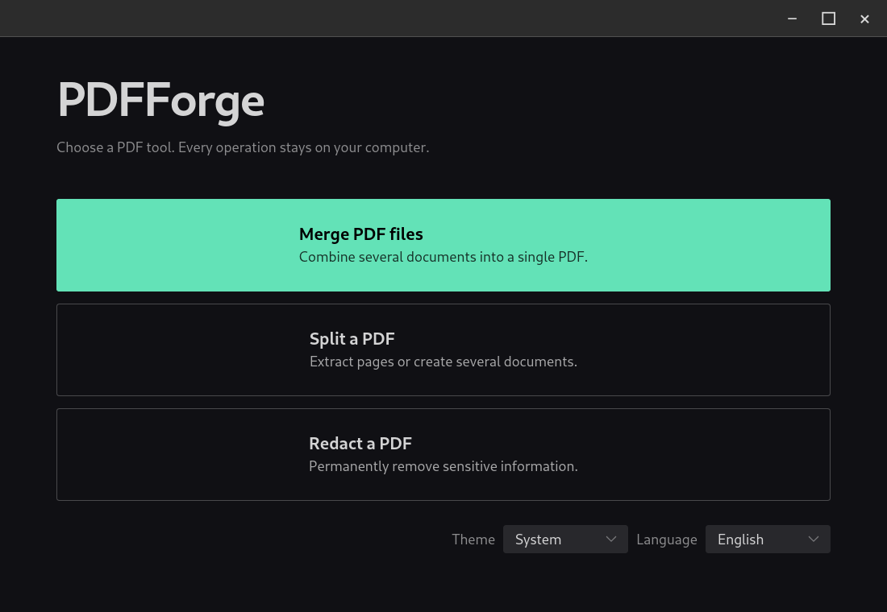
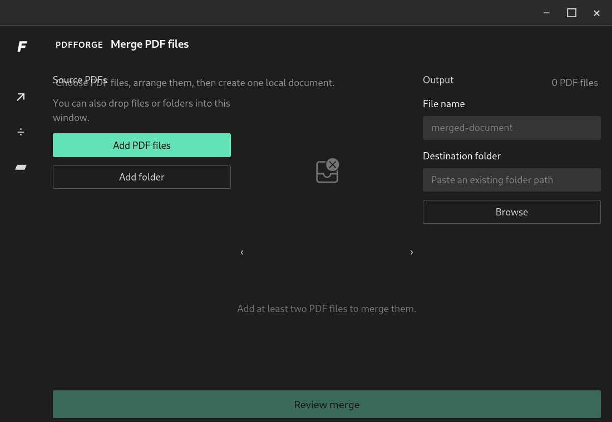
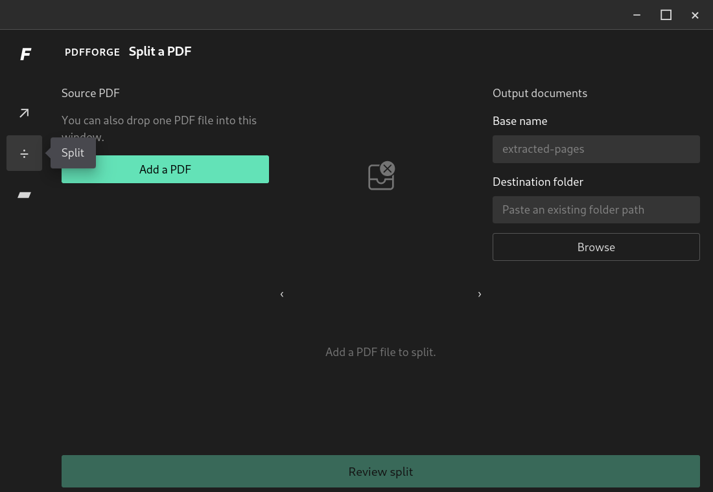
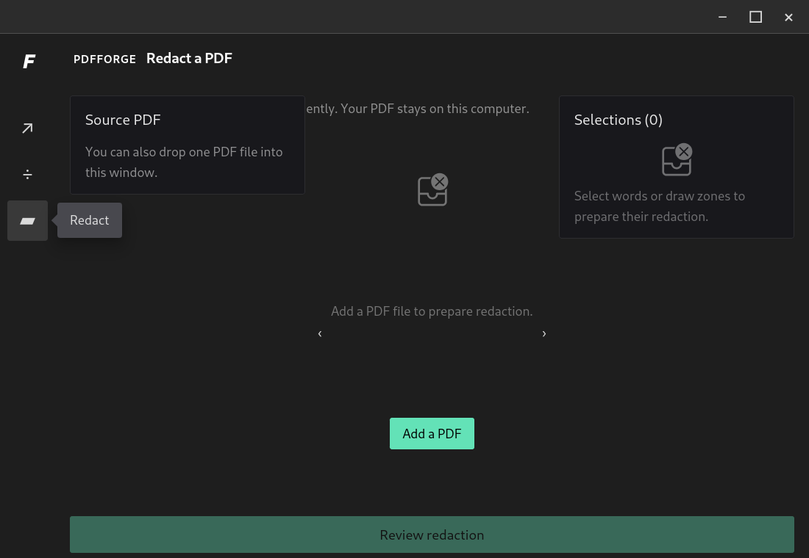

# PDFForge

PDFForge is a personal desktop application for working with PDF files directly
on your computer. Documents and processing stay local: no file is uploaded to
the Internet, no connection is required, and no history of processed PDFs is
kept after the application closes.

## Screenshots

## Features

### Merge PDFs

- Add at least two PDFs from your folders or by drag and drop, including the
  same file more than once when needed.
- Freely reorder them by drag and drop, then choose the name and folder for the
  final PDF.
- Review the summary before confirming. The generated PDF opens when processing
  is complete; source files are never changed.

Pages retain their size, orientation, and content. Before confirmation,
PDFForge warns you about interactive elements it cannot guarantee to preserve.

### Split a PDF

- Browse a document's page thumbnails.
- Create one PDF per page, extract selected pages, or compose several
  non-overlapping page groups.
- Choose a base name and folder for the generated files.

When splitting creates several PDFs, PDFForge opens only their containing
folder. Each result retains its pages' size and orientation, without modifying
the source document.

### Permanently redact information

- Select one or more words, or draw rectangles over sensitive areas — text,
  images, icons, or other content.
- Enlarge and zoom into pages to prepare your selections, then review, edit, or
  remove them before confirming.
- Generate a new PDF where selected areas are black and redacted information
  cannot be recovered.

By default, the result is saved next to the source document as
`<document-name>-masked.pdf`. Both its name and folder can be changed before
confirmation.

## Safe, predictable workflow

- Before any PDF is created, a summary describes the expected result and asks
  for confirmation.
- Progress is shown during processing, and an operation can be cancelled.
  Partial output files are then removed.
- If an output name already exists, PDFForge automatically appends a number —
  for example, `document-1.pdf` — without overwriting the existing file.
- Password-protected, unreadable, or inaccessible PDFs never trigger a password
  prompt: you can choose to skip them or stop the preparation.
- The application starts in your system language and supports documents from a
  few pages to several hundred pages.

## Availability

PDFForge is a portable application for Linux x86_64 and Windows x86_64. It is
licensed under [AGPL-3.0-or-later](LICENSE), copyright Zemoa.

## Project documentation

The [functional specification](specs/SFG.md) describes the validated scope. To
contribute to the project, see the [architecture decisions](ARCHITECTURE.md) and
the [development guide](DEVELOPMENT.md).
